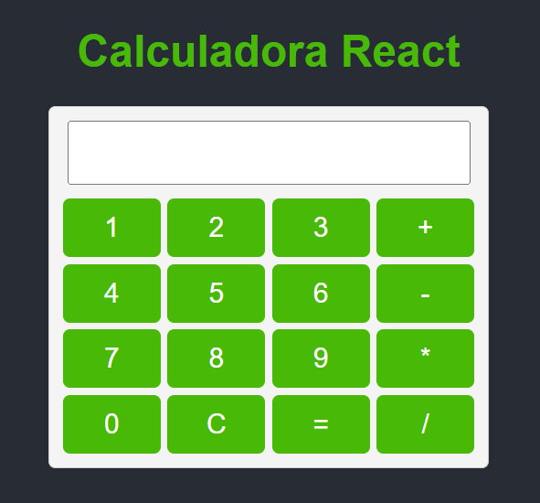

# Calculadora em React

Este é um projeto de uma calculadora simples criada usando React. É uma aplicação web que permite realizar operações matemáticas básicas, como adição, subtração, multiplicação e divisão.



## Funcionalidades

- Adição (+)
- Subtração (-)
- Multiplicação (*)
- Divisão (/)

## Tecnologias Utilizadas

- React
- HTML
- CSS

## Como Usar

1. Clone este repositório:

   ```bash
   https://github.com/Gustavocirulo/calculadora-react.git